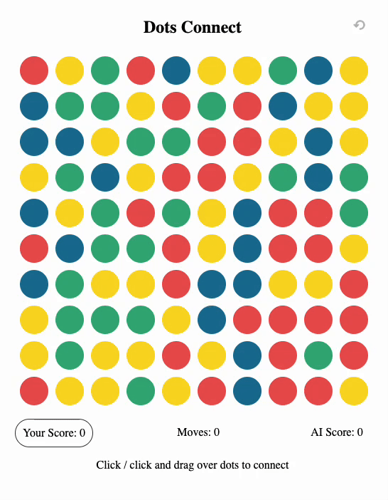

## Dots Connect

### Description
Dots Connect is a minimalist two-player game where players take turns connecting dots of the same color on a grid. The goal is to create the longest possible connections to score points.

### Features
- Two-player mode - Play against another person locally.
- AI mode - Play against an AI opponent for a solo challenge.
- Minimalist design - Focuses on gameplay with a simple and clean interface.
- Linked lists - Utilizes a linked list data structure to manage connected dots.
- DFS algorithm - Implements Depth-First Search for efficient dot connection management in the AI.

### How to Play

- Choose the game mode: two-player or AI.
- Players take turns connecting dots of the same color by drawing lines between them or clicking on dots.
- Players score points according to the number of dots connected.

